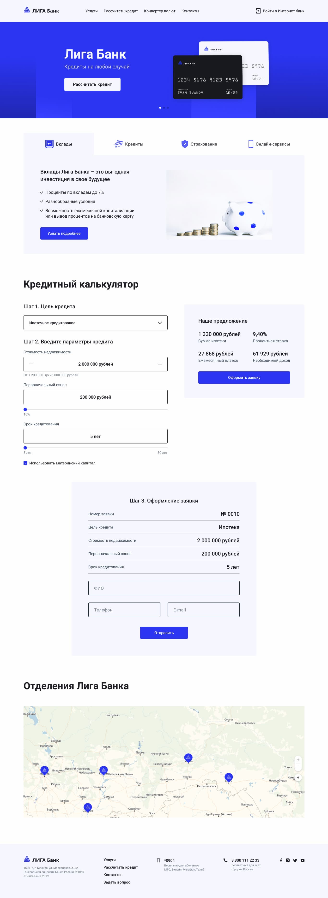

# Проект Лига Банк

Одностраничное приложение с кредитным калькулятором. Функционал:
- Адаптивность
- Слайдер с поддержкой свайпа
- Табы услуг
- Расчет кредита на основании введенных данных по шагам
- Валидация формы
---

Опубликованная версия - https://korovin-ligabank2.vercel.app/

---

## Технологии:
- React
- Redux
- Emotion / Styled Components
- Библиотеки Swiper, React-Yandex-Map, Reselect

---
## Превью:

---
### Инструкции:
1. Клонируйте репозиторий на локальную машину:
~~~
git clone git@github.com:pestrige/korovin_ligabank2.git
~~~
2. Перейдите в папку проекта:
~~~
cd korovin_ligabank2
~~~
4. Установите зависимости:
~~~
yarn install
~~~
5. Запустите проект командой:
~~~
yarn start
~~~
